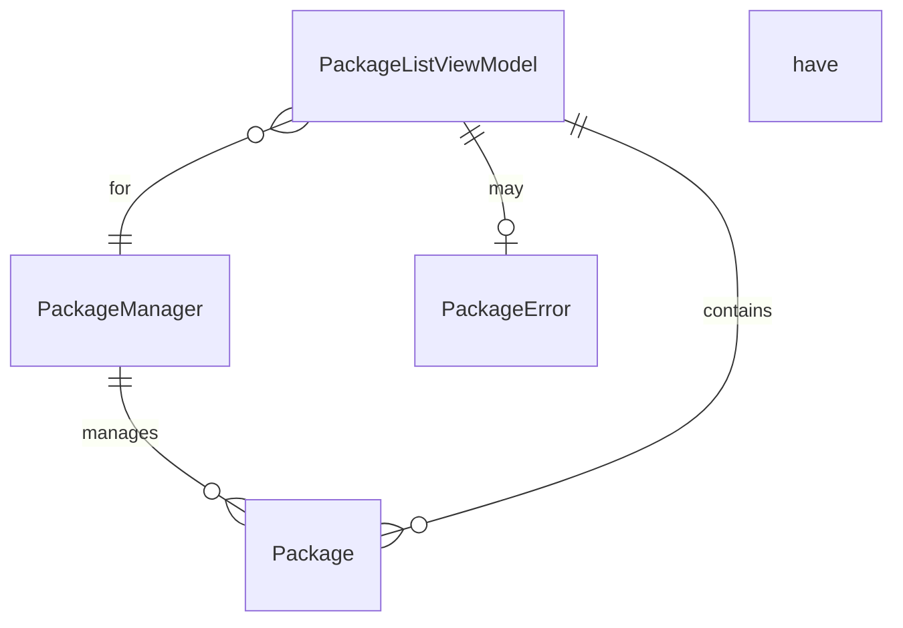

# Data Model: macOS Package Viewer

**Feature**: 001-package-viewer
**Date**: 2026-01-19
**Purpose**: Define data entities and their relationships for the package viewer application

## Overview

This document describes the core data entities for the macOS Package Viewer application. The application is read-only and does not persist data - all data is retrieved dynamically from package managers via shell commands.

## Entities

### Package

Represents a single installed software package from a package manager.

**Fields**:

| Field | Type | Optional | Description | Validation |
|-------|------|----------|-------------|------------|
| `id` | String | No | Unique identifier (package name + manager) | Non-empty |
| `name` | String | No | Package name (e.g., "react", "git") | Non-empty |
| `manager` | PackageManager | No | Package manager type | Must be valid enum |
| `size` | String | Yes | Human-readable size (e.g., "45.2 MB") | Valid size string |
| `description` | String | Yes | Package description/purpose | None |
| `installationDate` | Date | Yes | When package was installed | Valid Date |
| `version` | String | Yes | Package version | None |
| `path` | String | Yes | Filesystem path to package | Valid file path |

**Business Rules**:
- `name` and `manager` combination must be unique
- `size`, `description`, and `installationDate` may be unavailable (edge case: missing metadata)
- Display "N/A" for optional fields when unavailable
- `id` is computed as: `{manager.rawValue}/{name}` (e.g., "npm/react")

**State Transitions**: N/A (immutable data, fetched from package managers)

### PackageManager

Enum representing supported package manager types.

**Cases**:

| Case | RawValue | Description |
|------|----------|-------------|
| `npm` | "npm" | Node.js global packages |
| `homebrew` | "homebrew" | macOS Homebrew formulae |
| `pip` | "pip" | Python packages |

**Properties**:
- `displayName`: Human-readable name ("npm", "Homebrew", "pip")
- `iconName`: Asset catalog icon name for UI
- `isInstalled`: Boolean indicating if package manager is available

**Computed Properties**:
- `command`: CLI executable name ("npm", "brew", "pip")

### PackageListViewModel

View model that manages package state for a specific package manager.

**State**:

| Field | Type | Optional | Description |
|-------|------|----------|-------------|
| `packages` | `[Package]` | No | All loaded packages |
| `filteredPackages` | `[Package]` | No | Packages matching search query |
| `searchQuery` | String | No | Current search text |
| `isLoading` | Bool | No | Loading indicator state |
| `error` | PackageError? | Yes | Error if load failed |
| `isEmpty` | Bool | No | Computed: packages.isEmpty |

**Methods**:

| Method | Parameters | Returns | Description |
|--------|------------|---------|-------------|
| `loadPackages()` | None | `Void` | Fetch packages from package manager |
| `search(query:)` | String | `Void` | Update filteredPackages based on query |
| `clearSearch()` | None | `Void` | Reset filter to show all packages |
| `retry()` | None | `Void` | Retry failed package load |

**Business Logic**:
- `filteredPackages` is computed by filtering `packages` where `name.contains(searchQuery)` (case-insensitive)
- Search updates in real-time as user types (debounced 300ms)
- Loading state shows spinner; error state shows message with retry button

### PackageError

Error types for package operations.

**Cases**:

| Case | Associated Value | Description |
|------|------------------|-------------|
| `notInstalled` | None | Package manager not found on system |
| `timeout` | TimeInterval | Command execution timeout |
| `commandFailed` | String | Command failed with error message |
| `parseFailed` | String | JSON or output parsing failed |
| `unknown` | Error | Unexpected error |

**Properties**:
- `localizedDescription`: User-friendly error message
- `isRetryable`: Boolean indicating if operation can be retried

## Relationships



**Relationship Rules**:
- Each `Package` belongs to exactly one `PackageManager`
- `PackageListViewModel` is scoped to a single `PackageManager` type
- Multiple `PackageListViewModel` instances exist concurrently (one per tab)

## Data Flow

### Loading Flow

```
User Action (select tab)
    ↓
PackageListViewModel.loadPackages()
    ↓
PackageService.fetchPackages()
    ↓
ShellCommandService.execute()
    ↓
Parse Output → [Package]
    ↓
Update packages array
    ↓
SwiftUI updates view
```

### Search Flow

```
User types in SearchBar
    ↓
Debounced (300ms)
    ↓
PackageListViewModel.search(query:)
    ↓
Filter packages array
    ↓
Update filteredPackages
    ↓
SwiftUI updates list view
```

### Error Flow

```
PackageService.fetchPackages()
    ↓ (error occurs)
    ↓
Create PackageError
    ↓
PackageListViewModel.error = error
    ↓
isLoading = false
    ↓
SwiftUI displays error state
```

## Validation Rules

### Package Entity

1. **Name Validation**:
   - Must not be empty
   - Must match package manager naming conventions
   - Trim whitespace

2. **Size Validation**:
   - If present, must match pattern: `^[\d.]+\s+(B|KB|MB|GB)$`
   - Examples: "0 B", "45.2 MB", "1.5 GB"

3. **Path Validation**:
   - If present, must be valid absolute path
   - Use `URL(fileURLWithPath:)` for validation

4. **Installation Date**:
   - If present, must not be in the future

### Search Query

- Maximum length: 100 characters
- Trim leading/trailing whitespace
- Case-insensitive matching

## Performance Considerations

### Memory Management

- **Large Lists**: 1000+ packages at ~500 bytes each = ~500 KB (acceptable)
- **Lazy Loading**: SwiftUI List only renders visible rows
- **No Retention**: Release package data when tab is closed

### Caching Strategy

- **In-Memory Cache**: Cache loaded packages per package manager
- **Cache Duration**: Application session (cleared on app quit)
- **Invalidation**: None during session (packages don't change while app runs)

### Background Processing

- **Size Calculation**: Run on background queue (DispatchQueue.global())
- **Progressive Loading**: Show package names immediately, load metadata in background
- **Cancellation**: Support cancelling in-progress loads when switching tabs

## Testing Strategy

### Unit Tests

1. **Entity Tests**:
   - Test Package initialization with valid/invalid data
   - Test PackageManager enum properties
   - Test PackageError localized descriptions

2. **ViewModel Tests**:
   - Test loadPackages() success/failure scenarios
   - Test search filtering logic
   - Test state transitions (loading → loaded, loading → error)

3. **Service Tests** (with mocked shell output):
   - Test npm output parsing
   - Test Homebrew output parsing
   - Test pip output parsing
   - Test error handling

### Integration Tests

1. **End-to-End Flows**:
   - Load all three package types
   - Search and filter
   - Switch between tabs
   - Handle missing package manager

2. **Edge Cases**:
   - Empty package lists
   - Missing metadata
   - Command failures
   - Large package counts (500+)

## JSON Schemas

### npm list Output Example

```json
{
  "dependencies": {
    "package-name": {
      "version": "1.2.3",
      "resolved": "https://registry.npmjs.org/package-name/-/package-name-1.2.3.tgz",
      "from": "package-name@1.2.3",
      "path": "/path/to/node_modules/package-name"
    }
  }
}
```

### Homebrew Info Output Example

```json
{
  "formulae": [
    {
      "name": "git",
      "version": "2.43.0",
      "installed": [
        {
          "version": "2.43.0",
          "used_options": [],
          "built_as_bottle": true,
          "poured_from_bottle": true,
          "time": 1705037800,
          "runtime_dependencies": []
        }
      ],
      "desc": "Distributed version control system"
    }
  ]
}
```

### pip list Output Example

```json
[
  {
    "name": "package-name",
    "version": "1.2.3"
  }
]
```
